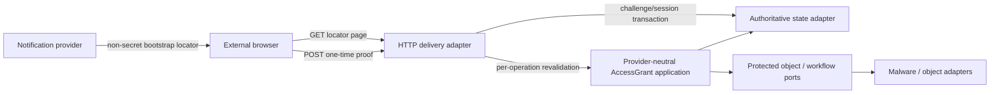

# Architecture

## Architectural style

Secure Exchange is a provider-neutral application core with replaceable infrastructure adapters.

The domain layer owns business meaning. Infrastructure and presentation layers translate to and from that domain without becoming the source of workflow or authorization truth.

## Preferred reference deployment

The approved initial reference architecture is AWS-first and customer-owned, with one isolated deployment per customer.

Reference building blocks:

- Amazon Cognito — initial staff identity-provider adapter;
- Amazon SES — notification-delivery adapter;
- Amazon S3 — protected object storage;
- AWS Lambda and API Gateway — application/API execution where appropriate;
- AWS KMS-backed controls — encryption/key management;
- GuardDuty Malware Protection for S3 — initial malware-scanning adapter;
- CloudTrail and CloudWatch — infrastructure/security telemetry;
- DynamoDB — initial application state-store adapter;
- Secure Exchange application audit events — workflow/security evidence.

No AWS resources are created by Release 0.1.

## Layer boundaries

### Domain

Contains provider-neutral entities, value objects, lifecycle rules, authorization policy, retention rules, audit semantics, and repository/service contracts.

The domain must not import Hono, Lambda, API Gateway, Cognito, DynamoDB, S3, SES, GuardDuty, or browser APIs.

### Application

Coordinates use cases and transaction boundaries. It invokes domain rules and abstract ports for persistence, identity context, object storage, notifications, malware status, and time.

### Adapters

Translate provider APIs into application/domain ports. AWS-specific keys, expressions, SDK types, ARNs, and request objects remain here.

### HTTP delivery

A thin Web-standards-oriented HTTP layer performs routing, request parsing, response construction, security middleware, and translation to application commands/queries.

### Web presentation

Semantic HTML/CSS with small TypeScript modules initially. Client code is not an authorization boundary.

## Trust boundaries

1. public internet to public submission/retrieval endpoints;
2. authenticated staff browser to application API;
3. application runtime to identity provider;
4. application runtime to state store;
5. application runtime to object storage;
6. object upload/scanning pipeline;
7. application runtime to notification provider;
8. application runtime to infrastructure logging;
9. deployment administration boundary.

See [Data Flow](DATA_FLOW.md) and [Threat Model](../security/THREAT_MODEL.md).

## Isolation

The preferred deployment model has no intentional application data path between customer deployments.

Every business record still carries a deployment/tenant context in the domain model so isolation assumptions are explicit, testable, and portable to alternative deployment models.

## Sensitive-content rules

Sensitive message/document content must not appear in:

- ordinary notification email bodies or subjects;
- URLs or query strings;
- browser analytics;
- infrastructure logs;
- error messages;
- public repository fixtures.

Opaque identifiers are preferred where identifiers leave the trusted application boundary.

## State consistency

Security-sensitive decisions use authoritative records.

DynamoDB secondary indexes may support queue/search views, but authorization, ownership, current lifecycle state, disposition eligibility, and other security-sensitive checks must validate authoritative base records where required.

## Retention

Secure Exchange-controlled disposition is authoritative. DynamoDB TTL may be used only as a cleanup/backstop mechanism and cannot be represented as timely retention enforcement.

See [Retention and Disposition](../security/RETENTION_AND_DISPOSITION.md).

## Portability

Provider-specific behavior is isolated behind interfaces. Portability means the core can be adapted without rewriting domain semantics; it does not mean all providers expose identical operational guarantees.

## Pre-production customer deployment refinement

The current repeatability target refines the existing AWS-first/customer-owned reference without changing its provider-neutral authority model:

- one isolated customer-owned AWS deployment per customer;
- mail-provider routing/redirect for ordinary records plus direct Secure Exchange portal upload for large/preferred submissions;
- private S3 staging and the accepted authoritative malware-gate semantics independent of the customer's mail/productivity storage;
- 500 MB/file and 1 GB/submission as production planning targets, not implemented Release 0.14 limits;
- customer differences expressed through bounded configuration rather than source forks;
- customer-first branding with discreet LDW/Secure Exchange attribution;
- GitHub-to-AWS infrastructure/application deployment using short-lived OIDC credentials as the intended repeatable update path;
- zero customer-specific development and <=1-2 hours active LDW labor as the mature clean-install target, not a present capability or customer quote;
- dental/Open Dental as the first concrete profile while the generic core remains suitable for separately validated medical, legal, and other sensitive-record workflows.

See [Customer Deployment, Ingress, Branding, and Repeatability Direction](CUSTOMER_DEPLOYMENT_AND_INGRESS.md).

## Release 0.12 production external-delivery boundary

Release 0.12 adds a constraining production-delivery architecture without changing the provider-neutral application authority model.

A future real external access flow is separated into three delivery layers:

1. a non-secret opaque bootstrap locator that may appear in an invitation URL;
2. a short-lived one-time bootstrap proof entered by the participant and verified through a non-reversible keyed verifier;
3. a new short-lived server-verified browser session whose raw bearer is never persisted.

Those layers do not replace the authoritative `AccessGrant`. The browser session is transport state only. Every protected request must still revalidate the authoritative deployment, thread, AccessGrant, explicit operation (`THREAD_READ`, `ATTACHMENT_READ`, or `THREAD_REPLY`), revocation, expiry, lifecycle/resource state, expected version where applicable, and the `AccessGrantAuthorityGuard` for reply mutation.

A usable bootstrap secret, raw AccessGrant bearer, browser session bearer, verifier, or CSRF secret is not permitted in URL path, query, fragment, redirect, generated hyperlink, or ordinary logging. The locator-only GET does not consume access, which permits benign mail-security prefetch/link inspection without establishing a session.

Production mutation protection is independent of login/bootstrap navigation and `SameSite`: non-GET method, exact Origin, same-origin Fetch Metadata where present, session-bound CSRF proof, current session, and current application authorization are required.

Release 0.12 defines `MAILBOX_ONLY` and `INDEPENDENT_CHALLENGE` assurance modes. Same-email link plus code is explicitly not MFA. Where protection against mailbox compromise is a requirement, an independent challenge or separately approved stronger external identity mechanism is required.

The preferred production deployment remains customer-owned and isolated. Runtime state, object storage, key/secrets, notification credentials, logs/backups, and customer-specific verification policy belong in customer-owned infrastructure. LDW administers through named role-based access rather than shared credentials. No cross-customer shared master secret is introduced.

Release 0.12 chooses no new production provider and creates no production infrastructure. Existing AWS choices remain reference adapters behind provider-neutral ports, not domain semantics.

See [External Delivery and Credential Bootstrap Boundary](EXTERNAL_DELIVERY_BOUNDARY.md) and [ADR-0005](../adr/0005-external-bootstrap-session-boundary.md).